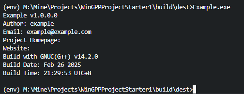

# WinGPPProjectStarter1

This is a simple project starter for WinGCC. It includes a simple framework for creating Win32 console applications using WinGCC.

> This project was generated from [LiuJiewenTT/WinGCCProjectStarter1](https://github.com/LiuJiewenTT/WinGCCProjectStarter1), which was originally generated from [LiuJiewenTT/WinEnv4MinGW-GCC](https://github.com/LiuJiewenTT/WinEnv4MinGW-GCC). To initialize the environment, you can follow the instructions in the [`env-README.md`](env-README.md) file.

To begin with, all you need to do is fill your information in `Makefile` and `version.rc`. Then, you can call `PROGRAM_INFO_STRING` in your `main()` function as the beginning of your program. Compile and run the program, you should see something like this: 

> Tip: You may consider deleting the `docs` directory on demand.